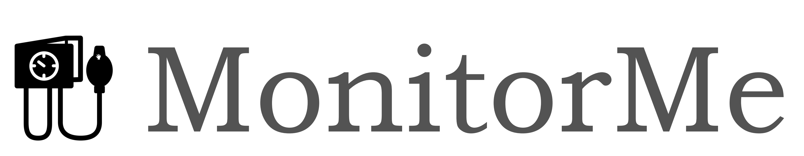

# Input given in scope of an Architectural Kata 2024 Winter - "MonitorMe"

*This document is based on the presented view ov [the raw slides](./00_Problem_raw.md).*

## **MonitorMe**

StayHealthy, Inc. is a large and highly successful medical software company located in San Francisco, California, US. They currently have 2 popular cloud-based SAAS products: **MonitorThem** and **MyMedicalData**.

**MonitorThem** a comprehensive data analytics platform that is used for hospital trend and performance analytics—alert response times, patient health problem analytics, patient recovery analysis, and so on.

**MyMedicalData** is a comprehensive cloud-based patient medical records system used by doctors, nurses, and other heath professionals to record and track a patients heath records with guaranteed partitioning between patient records.

StayHealthy, Inc. is now expanding into the medical monitoring market, and is in need of a new medical patient monitoring system for hospitals that monitors a patients vital signs using proprietary medical monitoring devices built by StayHealthy, Inc.

## Requirements

* **MonitorMe** reads data from eight different patient-monitoring equipment vital sign input sources: heart rate, blood pressure, oxygen level, blood sugar, respiration rate, electrocardiogram (ECG), body temperature, and sleep status (sleep or awake). It then sends the data to a consolidated monitoring screen (per nurses station) with an average response time of 1 second or less. The consolidated monitoring screen displays each patients vital signs, rotating between patients every 5 seconds. There is a maximum of 20 patients per nurses station.

* For each vital sign, **MonitorMe** must record and store the past 24 hours of all vital sign readings. A medical professional can review this history, filtering on time range as well as vital sign.

* In addition to recording raw monitoring data, the **MonitorMe** software must also analyze each patient’s vital signs and alert a medical professional if it detects an issue (e.g., decrease in oxygen level) or reaches a preset threshold (e.g., temperature has reached 104 degrees F).

* Some trend and threshold analysis is dependent on whether the patient is awake or asleep. For example, if the blood pressure drops, the system should notice that the patient is asleep and adjust its alerts accordingly. 
The same is true with the respiration rate and heart rate. For example, all of these vital signs are reduced when the patient is asleep, but if awake something might be wrong.

## Requirements (cont.)

* Medical professionals receive alert push notifications of a potential problem based on raw data analysis to a StayHeathy mobile app on their smart phone as well as the consolidated monitoring screen in each nurses station.

* If any of vital sign device (or software) fails, **MonitorMe** must still function for other vital sign monitoring (monitor, record, analyze, and alert).

* Medical staff can generate holistic snapshots from a patients consolidated vital signs at any time. Medical staff can then upload the patient snapshot to **MyMedicalData**. The upload functionality is within the scope of the **MonitorMe** functionality and is done through a secure HTTP API call within **MyMedicalData**.

* Each patient monitoring device transmits vital sign readings at a different rate:
  * Heart rate: every 500ms
  * Blood pressure: every hour
  * Oxygen level: every 5 seconds
  * Blood sugar: every 2 minutes
  * Respiration: every second
  * ECG: every second
  * Body temperature: every 5 minutes
  * Sleep status: every 2 minutes

* **MonitorMe** will be deployed as an on-premises system. Each physical hospital location will have its own installation of the complete **MonitorMe** system (including the recorded raw monitoring data).

* Maximum number of patients per physical **MonitorMe** instance: 500

* StayHealthy. Inc. will be providing a **comprehensive** hardware and software for this system. The platform, data stores, databases, and other technical tools and products are unspecified at this time and will be based on your on-prem architectural solution.

## Other Considerations

* StayHealthy, Inc. is looking towards adding more vital sign monitoring devices for **MonitorMe** in the future.

* Vital sign data analyzed and recorded through **MonitorMe** must be as accurate as possible. After all, human lives are at stake.

* As this is a new line of business for StayHealthy, they expect a lot of change as they learn more about this new market.

* StayHealthy, Inc. has always taken patient confidentially seriously. **MonitorMe** should be no exception to this rule. While patient monitoring data must be secure, **MonitorMe** does not have to meet any government regulatory requirements (e.g., HIPPA).
