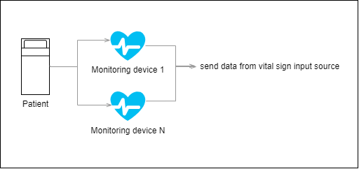
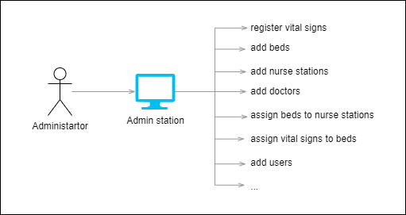
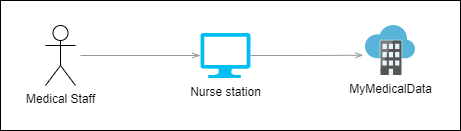

# Requirements decomposition

## Functional Requirements

Functional requirements are derived from input given by the stakeholders documented
there [Problem Description document](01_Problem_description.md).

| #                       | Requirement                                                                                                   |
|-------------------------|---------------------------------------------------------------------------------------------------------------|
| FR1   | Collect data from monitoring devices. See [Device list](#device-list).[[DESC4]](./01_Problem_description.md#DESC4)                                        |
| FR2   | Display data from monitoring devices on monitoring screen per nurse station[[DESC5]](./01_Problem_description.md#DESC5)                                   |
| FR3   | Display data rotating between patients every 5 seconds[[DESC5]](./01_Problem_description.md#DESC5) |
| FR4   | Monitoring data should be available during last 24 hours for the review[[DESC6]](./01_Problem_description.md#DESC6)                                       |
| FR5   | Review of vital signs history is possible, filtering on time range as well as vital sign[[DESC6]](./01_Problem_description.md#DESC61)                      |
| FR6   | System analyzes each patient’s vital signs[[DESC7]](./01_Problem_description.md#DESC7)                                                                    |
| FR7   | Send alert in case of any vital sign value is out of regular range[[DESC7]](./01_Problem_description.md#DESC7)                                            |
| FR8   | Regular range value (alert thresholds) depends on patient sleep state[[DESC7]](./01_Problem_description.md#DESC7)                                         |
| FR9   | Alerts received on mobile app and displayed on monitoring screen as well[[DESC10]](./01_Problem_description.md#DESC10)                                      |
| FR10 | Generate holistic snapshots from a patients consolidated vital signs at any time[[DESC22]](./01_Problem_description.md#DESC22)                             |
| FR11 | Upload the patient snapshot to MyMedicalData[[DESC22]](./01_Problem_description.md#DESC22)                                                                  |

### Device list

Each patient monitoring device transmits vital sign readings at a different rate:[[DESC13]](./01_Problem_description.md#DESC13)

* Heart rate: every 500ms[[DESC14]](./01_Problem_description.md#DESC14)
* Blood pressure: every hour[[DESC15]](./01_Problem_description.md#DESC15)
* Oxygen level: every 5 seconds[[DESC16]](./01_Problem_description.md#DESC16)
* Blood sugar: every 2 minutes[[DESC17]](./01_Problem_description.md#DESC17)
* Respiration: every second[[DESC18]](./01_Problem_description.md#DESC18)
* ECG: every second[[DESC19]](./01_Problem_description.md#DESC19)
* Body temperature: every 5 minutes[[DESC20]](./01_Problem_description.md#DESC20)
* Sleep status: every 2 minutes[[DESC21]](./01_Problem_description.md#DESC21)

## Non-functional Requirements

Non functional requirements are derived from functional requirements and business context.

### Robustness/Fault tolerance

* [NFR1] System should continue to collect and display data regardless on any particular device
  availability.[[DESC11]](./01_Problem_description.md#DESC11)

### Reliability

* [NFR2] Monitoring data should not be corrupted by the system during processing and should have
  precise cohesion to the coupled data managed by other system

### Scalability/Elasticity

* [NFR3] There is a maximum of 20 patients per nurses station.[[DESC5]](./01_Problem_description.md#DESC5)
* [NFR4] Maximum number of patients per physical MonitorMe instance: 500[[DESC23]](./01_Problem_description.md#DESC23)
* [NFR5] The system should be elastic when adding/removing new hospitals. (Change data volume,
  traffic and computing units)[[DESC25]](./01_Problem_description.md#DESC25)

### Perfomance

* [NFR6]  Monitoring device data should be available for visualisation or alerting within less than 1
  second.[[DESC5]](./01_Problem_description.md#DESC5)

### Evolvability

* [NFR7] System should be prepared to add new type of Patient-monitoring Device should be efficient
  in terms of cost and time
* [NFR8] System should be prepared to add/delete new functionality as we expect a lot of changes.

### Security/Privacy

* [NFR9] Patient related data should not be available for the audience which it is not intended to
* [NFR10] All raw data from all monitoring devices is stored in the system

## Requirements matrix

| FR/TR         | Availability | [Scalability](#scalabilityelasticity) | [Performance](#perfomance) | Consistency | Cost | [Evolvability](#evolvability) | Usability | [Reliability](#reliability) | [Robustness](#robustnessfault-tolerance) | [Security](#securityprivacy) |
|---------------|--------------|-------------|-------------|-------------|------|--------------|-----------|-------------|------------|----------|
| [FR1](#FR1)   |              |             |             |             |      |              |           |             |            |          |
| [FR2](#FR2)   |              |             |             |             |      |              |           |             |            |          |
| [FR3](#FR3)   |              |             |             |             |      |              |           |             |            |          |
| [FR4](#FR4)   |              |             |             |             |      |              |           |             |            |          |
| [FR5](#FR5)   |              |             |             |             |      |              |           |             |            |          |
| [FR6](#FR6)   |              |             |             |             |      |              |           |             |            |          |
| [FR7](#FR7)   |              |             |             |             |      |              |           |             |            |          |
| [FR8](#FR8)   |              |             |             |             |      |              |           |             |            |          |
| [FR9](#FR9)   |              |             |             |             |      |              |           |             |            |          |
| [FR10](#FR10) |              |             |             |             |      |              |           |             |            |          |
| [FR11](#FR11) |              |             |             |             |      |              |           |             |            |          |
| [NFR1](#FR1)  |              |             |             |             |      |              |           |             |            |          |
| [NFR2](#FR2)  |              |             |             |             |      |              |           |             |            |          |
| [NFR3](#FR3)  |              |             |             |             |      |              |           |             |            |          |
| [NFR4](#FR4)  |              |             |             |             |      |              |           |             |            |          |
| [NFR5](#FR5)  |              |             |             |             |      |              |           |             |            |          |
| [NFR6](#FR6)  |              |             |             |             |      |              |           |             |            |          |
| [NFR7](#FR7)  |              |             |             |             |      |              |           |             |            |          |
| [NFR8](#FR8)  |              |             |             |             |      |              |           |             |            |          |
| [NFR9](#FR9)  |              |             |             |             |      |              |           |             |            |          |

## Architecture Characteristics

| Top 3 | # | Driving Characteristics |
|-------|---|-------------------------|
| x     | 1 | Availability            |
|       | 2 | Consistency             |
| x     | 3 | Evolvability            |
|       | 5 | Reliability             |
| x     | 6 | Robustness              |
|       | 7 | Security                |

| # | Implicit Characteristics |
|---|--------------------------|
| 1 | Usability                |
| 2 | Simplicity               |

| # | Others considered |
|---|-------------------|
| 1 | Cost              |

## Actors

| Actor                     | Description                                                                                                  | Use Case Reference  |
|---------------------------|--------------------------------------------------------------------------------------------------------------|---------------------|
| Patient                   | Produce metrics via monitoring device trips.                                                                 | no system use cases |
| Medical Staff             | Including Nurses.                                                                                            |                     |
| Medical Professionals     | Including doctors.                                                                                           |                     |
| Administrator             | Dedicated role in Medical Professionals/Staff or external employer, who responsible for configuration system |                     |
| Patient-monitoring Device | System Actor Patient-monitoring Device to deliver vital sign.                                                |                     |
| MyMedicalData             | System Actor MyMedicalData is a comprehensive cloud-based patient medical records                            |                     |
| System                    | Some activities are initiated by the system internally.                                                      |                     |

### Patient

### Medical Staff and Medical Professionals

### Administrator

### Patient-monitoring Device

### MyMedicalData

## Use Cases

| #                       | Use Case                               | Short Description                                                                        | Actor                                        | Requirement |
|-------------------------|----------------------------------------|------------------------------------------------------------------------------------------|----------------------------------------------|-------------|
| UC01 | Login into system                      | User logs in into the system.                                                            | [Medical Staff / Medical Professionals](#medical-staff-and-medical-professionals)       |             |
| UC02 | Register Medical staff in system       | Registers Medical Staff and Medical Professionals in system.                             | [Administrator](#administrator)                                |             |
| UC03 | Assign access roles to Medical staff   | Assign access roles to Medical staff in the system.                                      | [Administrator](#administrator)                                |             |
| UC04 | Mapping Devices                        | Configure system by adding new devices and mapping them to "patient bed" and Nurses      | [Administrator](#administrator)                                |             |
| UC05 | Register Patient in system             | Registers Patient and assign him to "bed" and to Doctor                                  | [Medical Staff](#medical-staff-and-medical-professionals)                                |             |
| UC06 | Collect vital sign                     | System collect vital signs from patient-monitoring devices.                              | [Patient-monitoring Device](#patient)             |             |
| UC07 | Monitor patient vital status           | Nurse able to monitor all vital signs from patients                                      | [Medical Staff](#medical-staff-and-medical-professionals), [Patient](#patient)                       |             |
| UC08 | Configure Thresholds                   | Configure thresholds for different types on vital sign (also interdependent signs)       | [Administrator](#administrator)                                |             |
| UC09 | Receive Alert notification             | Medical Staff receive notification if any thresholds achieved                            | [Medical Professionals](#medical-staff-and-medical-professionals)                |             |
| UC10 | Generate vital sings snapshot          | Medical Professionals configure snapshot of data and data stored in MyMedicalData system | [Medical Professionals](#medical-staff-and-medical-professionals), MyMedicalData |             |
| UC11 | Analyse historical vital data          | Medical Professionals can view, filter vital sign history in frame of 24h                | [Medical Professionals](#medical-staff-and-medical-professionals)                        |             |
| UC12 | Managing Hospitals/MonitorMe Instances | StayHealthy technical staff able to provision new Hospital/MonitorMe instance            | [Administrator](#administrator)                                |             |
| UC13 | Discharge patient                      | Unassign patient from "bed" and from Doctor                                              | [Medical Staff](#medical-staff-and-medical-professionals)                                |             |
