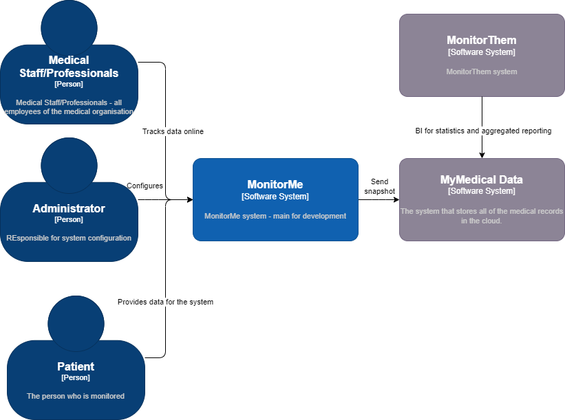

# System context MonitorMe

> Defines the boundaries between the system and its communication counterparts (adjacent systems and users). It outlines the external interfaces, presenting both a business/domain viewpoint and a technical standpoint.

We concentrate here on the main actors and external systems.

More detailed view on the **MonitorMe** system is in [Container](./04_container-component_view.md#monitorme---container-diagram) and [Component](./04_container-component_view.md#monitorme-hospital---component-diagram) views.
