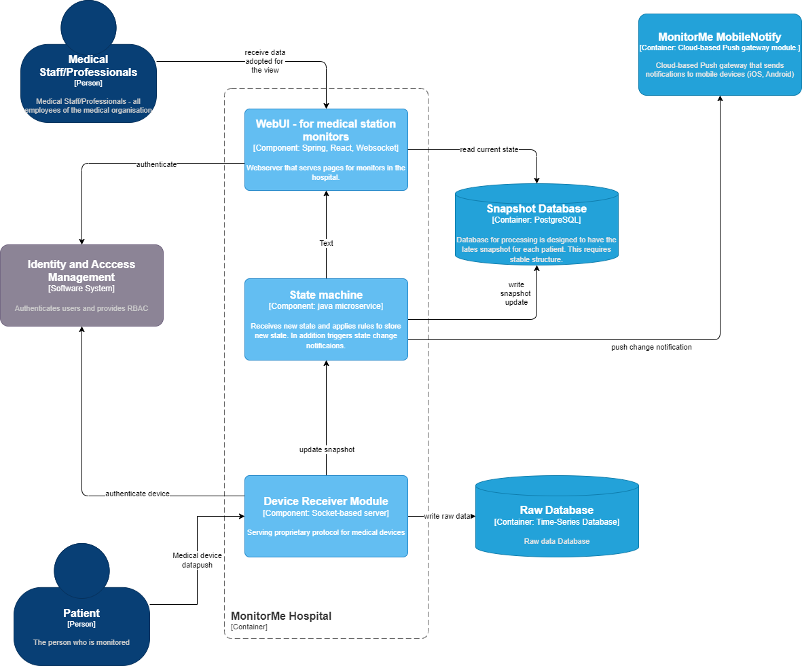

# Detailed system views

Deployment diagrams that help with understanding of system deployment and modules. 

## MonitorMe - Container diagram

This view describes general deployment view of the system with interconnection of the systems.

## MonitorMe Hospital - Component diagram

Container that deployed to the Hospital infrastructure locally consists of several components.
They have strict functionality assignment and can be decomposed in separate containers in future for scaling purposes.

