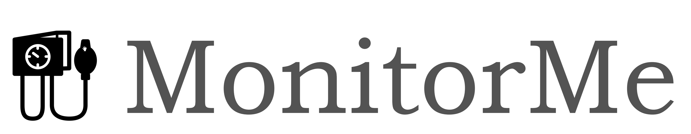

# Architectural Katas 2024 Winter - Team Ctrl-Arch-Elite

## Intro

This repository contains the results produced by the Team "Ctrl-Arch-Elite" during the Architectural Kata @ O’Reilly.

> Architectural Kata, inspired by Code Kata, is a group exercise aimed at improving software architecture design skills, allowing participants to gain experience and receive feedback from other participants. Such activities are conducted to promote good architectural practices, focusing on specific architectural styles, such as monolithic or micro-services architecture, or specific quality requirements (security, data privacy, performance etc.)  (Usman Nasir, Blekinge Institute of Technology, Sweden)

## Results

Our task was to develop architecture description which covers requirements for MonitorMe system (inital requirements documentd in [Problem Description document](/0_Requirements/01_Problem_description.md)).

Our architectural description is structured into several chapters. Please utilize the following table of contents to navigate to specific topics:

* [Introduction and Goals](0_Requirements/02_Vision.md)
* [Requirements](0_Requirements/03_Requirements.md)
* [Architecture principles](1_Solution/01_arch_priciples.md)
* [Architecture charaсteristics](1_Solution/02_arch_characteristics.md)
* C4 architecture model[[standard]]([./01_Problem_description.md#DESC7](https://c4model.com/))
  * [Context view](1_Solution/03_system_context.md)
  * [Container view](1_Solution/04_container-component_view.md#monitorme---container-diagram)
  * [Component view](1_Solution/04_container-component_view.md#monitorme-hospital---component-diagram)
* [Architecture Decisions](ADRs/Readme.md)

## Team

[Deutsche Telekom IT]([https://](https://www.telekom.com/de/karriere/woran-wir-arbeiten/telekom-it)) team **Ctrl-Arch-Elite**:

- [@formalizator](https://github.com/formalizator)
- [@vera-ignateva](https://github.com/vera-ignateva)
- [@slookin](https://github.com/slookin)
- [@alkhamov](https://github.com/alkhamov)

We focus on simple-to-consume architectures!
